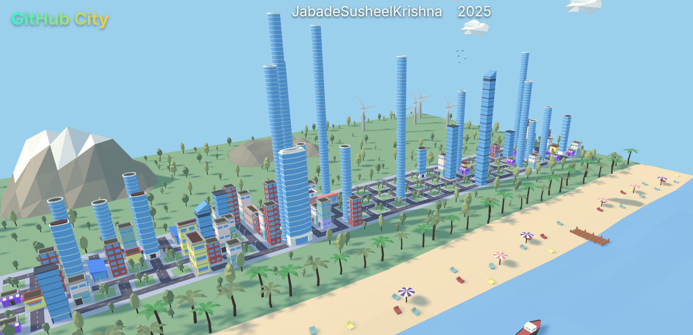

  <!-- <h1>Hi there, I'm Susheel Krishna Jabade 👋</h1>
  
<strong>B.Tech in Computer Science & Engineering @ IIIT Hyderabad (Class of 2026)</strong>
 -->
  
  

    
    
    
    
  

  

   
  <h4>🚀 Software Developer | Distributed Systems Enthusiast | AI/ML & Agentic AI Explorer</h4>

---

### 👤 About Me

I am a final-year Computer Science undergraduate student at the **International Institute of Information Technology, Hyderabad (IIIT-H)**. I specialize in building robust distributed systems, low-latency networking architectures, and intelligent multi-agent AI platforms. With experience in both enterprise software development (AT&T) and health-tech integrations (VP Innovations), I enjoy solving complex performance, scalability, and security bottlenecks.

- 🔭 **Current Focus:** Advanced system design, LLM agents (MCP), and real-time networking.
- 🌱 **Learning & Researching:** Agentic AI architectures, Model Context Protocols, and advanced DevOps/Kubernetes.
- 👯 **Collaboration:** Open to collaborating on open-source distributed systems, database engines, and AI orchestration.

---

### 📊 GitHub Metrics & Insights

  <table border="0">
    <tr>
      <td align="center" valign="top">
        
        <!--  -->
      </td>
      <td align="center" valign="top">
        
      </td>
    </tr>
  </table>
   
  

---

### 🛠️ Technical Skills

<table>
  <tr>
    <td valign="top" width="50%">
      <h4>💻 Languages & Core</h4>
      
      
      
      
      
      
    </td>
    <td valign="top" width="50%">
      <h4>🌐 Web, App & Databases</h4>
      
      
      
      
      
      
      
      
      
    </td>
  </tr>
  <tr>
    <td valign="top" width="50%">
      <h4>⛓️ Systems & Networking</h4>
      
      
      
      
      
    </td>
    <td valign="top" width="50%">
      <h4>🤖 AI/ML & Agentic AI</h4>
      
      
      
      
      
    </td>
  </tr>
  <tr>
    <td valign="top" colspan="2">
      <h4>⚙️ DevOps & Cloud Orchestration</h4>
      
      
      
      
      
      
      
      
    </td>
  </tr>
</table>

---

### 💼 Professional Experience

  
<strong>💻 Software Developer Intern | AT&T (March 2024 – June 2024)</strong>

   
  <ul>
    <li><strong>EHR Sharing System:</strong> Developed a secure Electronic Health Record sharing system that replaced insecure email-based exchanges with a centralized, FHIR-compliant server.</li>
    <li><strong>Security & Efficiency:</strong> Implemented Hash ID–based identity protection and consent-driven data retrieval, boosting security and overall data accessibility by <strong>30%</strong>.</li>
    <li><strong>Full-Stack Implementation:</strong> Designed the backend APIs, responsive web dashboards, and a React Native mobile application for granular patient consent management.</li>
  </ul>

  
<strong>🏥 Software Developer Intern | VP Innovations (January 2024 – February 2024)</strong>

   
  <ul>
    <li><strong>Cross-Platform Sync:</strong> Engineered a cross-platform health-monitoring application integrating Google Fit and Samsung Health APIs via Health Connect, syncing wearable sensors in real-time with Firebase.</li>
    <li><strong>AI Insights:</strong> Devised a Python-based Naive Bayes classifier model to analyze activity logs and provide customized wellness recommendations, improving accuracy by <strong>15%</strong>.</li>
  </ul>

---

### 🚀 Featured Projects

#### [🌐 Online Peer-to-Peer Meeting Platform](https://github.com/SuryaNarayanaJabade/online-meeting-webrtc-MS)
- **Tech Stack:** `MERN Stack`, `Docker`, `WebRTC`, `Firebase`
- Architected a microservices-based P2P streaming web app supporting up to **10,000+ concurrent users** for real-time video/audio.
- Containerized the microservices using Docker and integrated Firebase for fast real-time signaling, lowering video stream latency by **25%** and achieving **99.95% availability**.

#### [📰 RSS Reader: System Redesign & Feature Enhancement](https://github.com/SuryaNarayanaJabade/RSS_Reader-System_Redesign_and_Feature_Enhancement)
- **Tech Stack:** `Java`, `Spring Boot`, `OOP`, `SonarQube`, `Jenkins`
- Refactored legacy modular structures by addressing **20+ architectural and design smells** identified via SonarQube and UML, boosting codebase quality metrics by **15%**.
- Extended capabilities with custom user modules, bug reporting logs, and AI-powered feed summaries. Automated code quality checks and CI/CD pipelines using Jenkins.

#### [💾 Distributed Network File System](https://github.com/JabadeSusheelKrishna/Network_File_System)
- **Tech Stack:** `C`, `System Calls`, `POSIX Sockets`, `Thread Concurrency`
- Developed a multi-tier Distributed NFS featuring centralized Naming, Storage, and Client server processes.
- Structured thread-safe concurrent access locks and implemented robust data replication strategies, improving transactional transfer consistency by **30%**.

#### [🗄️ SimpleRA: A Minimalist Integer-Only RDBMS](https://github.com/JabadeSusheelKrishna/SimpleRA-RDBMS)
- **Tech Stack:** `C++`, `SQL Parser`, `CMake`, `B+ Tree`
- Designed an SQL engine featuring an custom query lexer/parser, executors (SELECT, INSERT, UPDATE), and page-mapped B+ Tree indices.
- Engineered memory page eviction buffers, speeding query evaluation times by **60%** over standard naive disk baselines.

#### [🤖 Polymind AI: Multi-Agent Reasoning System](https://github.com/SuryaNarayanaJabade/Polymind-AI---A-Multi-Agent-Based-Chatbot)
- **Tech Stack:** `Python`, `MCP (Model Context Protocol)`, `LLMs`, `Web Scraping`
- Created a terminal-based multi-agent orchestration shell with specialized routing to Coding, Mathematics, and General knowledge agents.
- Armed agents with custom Model Context Protocol (MCP) tools for local file operations, sandboxed code execution, and web research, ensuring accurate structured output formatting.

---

### 🎨 Community & Interests
- **Hackathons:** Regular participant in national hackathons and developer meetups.
- **Blogging & Tech Writing:** Passionate reader and writer of posts detailing microservices, database optimizations, and the Model Context Protocol.

  

